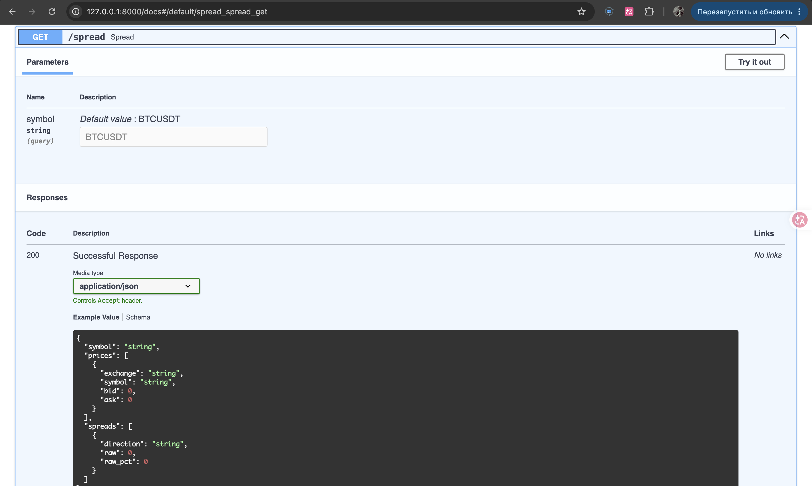
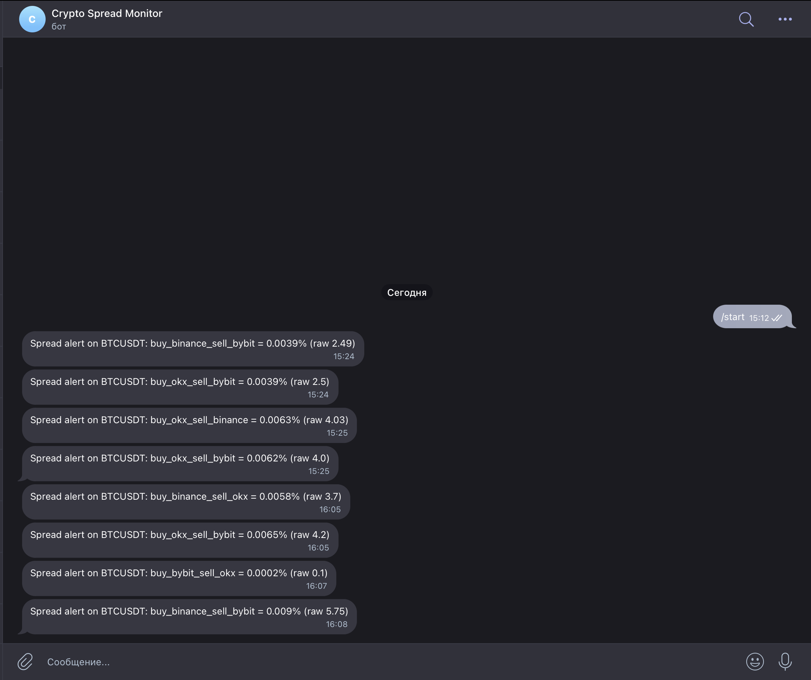

# Crypto Spread Aggregator

Real-time monitor of price spreads across **Binance, Bybit, and OKX**. It pulls the
best bid/ask from every exchange in parallel, computes the spread for each exchange
pair, stores a price history in PostgreSQL, and pushes a Telegram alert whenever a
spread crosses a configurable threshold.

## Features

- Fetches best bid/ask from **three exchanges in parallel** (Binance, Bybit, OKX) over async HTTP.
- Computes the spread for **every exchange pair and both directions** (buy on one venue, sell on the other).
- **Caches** exchange responses in Redis with a short TTL, so bursts of requests don't hammer the APIs.
- **Persists** every price snapshot in PostgreSQL and exposes a queryable history endpoint.
- Runs a **background scheduler** that samples prices every 30 s, independently of API traffic.
- Sends **Telegram alerts** on threshold breaches, **deduplicated** to one message per direction per 15 min.
- **Configurable via `.env`** (symbol, threshold, interval, credentials) and self-documenting through OpenAPI/Swagger.

## Stack

- **Python 3.11+** (developed on 3.13)
- **FastAPI** 0.139 — HTTP API and OpenAPI docs
- **PostgreSQL** 16 (Docker) — price history
- **Redis** 7 (Docker) — response cache and alert deduplication
- **SQLAlchemy** 2.0 — ORM
- **APScheduler** 3.11 — background sampling job
- **Pydantic** 2.13 / **pydantic-settings** 2.14 — response schemas and configuration
- **httpx** 0.28 — async exchange clients
- **Uvicorn** 0.51 — ASGI server

## Architecture

**Request flow — `GET /spread`:**

```
  Binance ┐
  Bybit   ├─ async HTTP ─▶ Exchange clients ─▶ Redis cache ─▶ Spread calc ─▶ JSON response
  OKX     ┘               (adapter pattern)     (TTL 2 s)     (all pairs)
                                  │
                                  └─▶ Postgres (snapshot) ──▶ queryable via GET /history
```

**Background flow — every 30 s:**

```
  APScheduler ─▶ collect prices ─▶ Spread calc ─▶ spread > threshold? ─▶ Telegram alert
                                                                          (deduped 15 min)
```

Each exchange is wrapped in an **adapter** (`ExchangeClient` subclass) that normalizes
its API into a common `{exchange, symbol, bid, ask}` shape, so adding a venue means
writing one class — the rest of the pipeline is unchanged.

```
crypto-spread/
├── app/
│   ├── main.py        # FastAPI app, lifespan, endpoints (/health, /spread, /history)
│   ├── config.py      # Settings loaded from .env (pydantic-settings)
│   ├── exchanges.py   # Async exchange clients (adapter pattern) + Redis caching
│   ├── spreads.py     # Spread calculation across all exchange pairs
│   ├── scheduler.py   # APScheduler job: collect prices, detect breaches, alert
│   ├── notifier.py    # Telegram sender with Redis-based deduplication
│   ├── cache.py       # Redis client
│   ├── database.py    # SQLAlchemy engine and session factory
│   ├── models.py      # PriceSnapshot ORM model
│   └── schemas.py     # Pydantic response schemas
├── docker-compose.yml # Postgres + Redis services
├── requirements.txt
├── .env.example
└── README.md
```

## Getting started

```bash
# 1. Clone
git clone https://github.com/mxalle/crypto-spread.git
cd crypto-spread

# 2. Virtual environment
python3 -m venv venv
source venv/bin/activate          # Windows: venv\Scripts\activate

# 3. Dependencies
pip install -r requirements.txt

# 4. Configuration
cp .env.example .env
# Edit .env: set POSTGRES_PASSWORD and use the SAME password inside DATABASE_URL.
# Telegram credentials are optional — without them, alerts are simply skipped.

# 5. Start Postgres + Redis
docker compose up -d
# Give Postgres a few seconds to become ready on the first run.

# 6. Run the app
uvicorn app.main:app --reload
```

The API is now at `http://127.0.0.1:8000`. Interactive OpenAPI docs — every endpoint
and response schema, ready to try in the browser — live at
`http://127.0.0.1:8000/docs`:



### Configuration (`.env`)

| Variable | Default | Description |
|---|---|---|
| `DATABASE_URL` | `postgresql://postgres:<password>@127.0.0.1:5432/crypto` | Postgres DSN. Password must match `POSTGRES_PASSWORD`. |
| `REDIS_URL` | `redis://127.0.0.1:6379` | Redis connection string. |
| `SYMBOL` | `BTCUSDT` | Trading pair to monitor. |
| `SPREAD_THRESHOLD` | `0.05` | Alert threshold, in **percent** (`0.05` = 0.05 %). |
| `COLLECT_INTERVAL` | `30` | Scheduler sampling interval, seconds. |
| `PRICE_CACHE_TTL` | `2` | Redis cache TTL for prices, seconds. |
| `ALERT_TTL` | `900` | Alert dedup window, seconds (15 min). |
| `TELEGRAM_BOT_TOKEN` | — | Bot token from @BotFather. |
| `TELEGRAM_CHAT_ID` | — | Target chat id. |
| `POSTGRES_PASSWORD` | — | Used by docker-compose to initialize Postgres. |

## Endpoints

| Method | Path | Description | Parameters |
|---|---|---|---|
| `GET` | `/health` | Liveness check. | — |
| `GET` | `/spread` | Current prices from all exchanges plus the spread for every pair. | `symbol` (default `BTCUSDT`) |
| `GET` | `/history` | Stored price snapshots, newest first. | `symbol` (default `BTCUSDT`), `exchange` (optional), `limit` (1–500, default 50) |

Example — `GET /spread?symbol=BTCUSDT`:

```json
{
  "symbol": "BTCUSDT",
  "prices": [
    { "exchange": "binance", "symbol": "BTCUSDT", "bid": 64686.08, "ask": 64686.09 },
    { "exchange": "bybit",   "symbol": "BTCUSDT", "bid": 64689.30, "ask": 64689.40 },
    { "exchange": "okx",     "symbol": "BTCUSDT", "bid": 64686.50, "ask": 64686.60 }
  ],
  "spreads": [
    { "direction": "buy_bybit_sell_binance", "raw": -3.32, "raw_pct": -0.0051 },
    { "direction": "buy_binance_sell_bybit", "raw":  3.21, "raw_pct":  0.0050 },
    { "direction": "buy_okx_sell_binance",   "raw": -0.52, "raw_pct": -0.0008 },
    { "direction": "buy_binance_sell_okx",   "raw":  0.41, "raw_pct":  0.0006 },
    { "direction": "buy_okx_sell_bybit",     "raw":  2.70, "raw_pct":  0.0042 },
    { "direction": "buy_bybit_sell_okx",     "raw": -2.90, "raw_pct": -0.0045 }
  ]
}
```

`raw` is the absolute price difference; `raw_pct` is the same as a percentage of the
buy-side ask. If an exchange fails, it is dropped from the response and logged —
the other venues still return.

## Notifications

Telegram alerts are optional and wired through `.env`:

1. Create a bot with [@BotFather](https://t.me/BotFather) and copy its **token**.
2. Get your **chat id** — message your bot, then open
   `https://api.telegram.org/bot<token>/getUpdates` and read `chat.id` (or use
   [@userinfobot](https://t.me/userinfobot)).
3. Put both into `.env` as `TELEGRAM_BOT_TOKEN` and `TELEGRAM_CHAT_ID`.

The scheduler samples prices every `COLLECT_INTERVAL` seconds and fires an alert when
any spread exceeds `SPREAD_THRESHOLD` (percent). To avoid spam, each direction is
muted for `ALERT_TTL` seconds (15 min) after a successful send.



## Limitations and roadmap

Known limitations, stated up front:

- **Raw spread, no fees.** Spreads are gross. A real arbitrage must clear the round-trip
  cost (~0.2 %), so a meaningful `SPREAD_THRESHOLD` should sit above that — the current
  default is tuned for observing the mechanism, not for live trading.
- **Single symbol.** Only one pair (`SYMBOL`) is tracked; multi-pair monitoring is not implemented.
- **One-way bot.** It sends alerts but does not accept commands.
- **No tests, no authentication.** The API is open and unverified.

Natural next steps: fee-aware net spread, multiple symbols, interactive bot commands,
a test suite, and API authentication.
